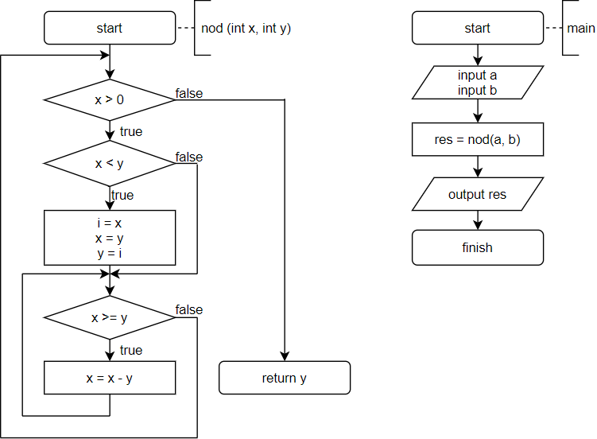
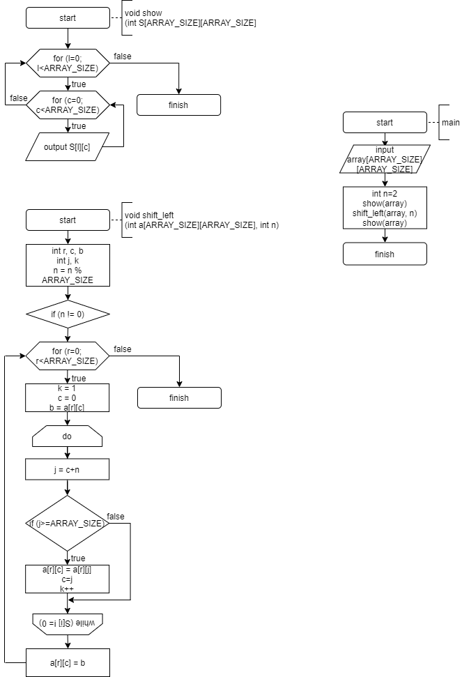
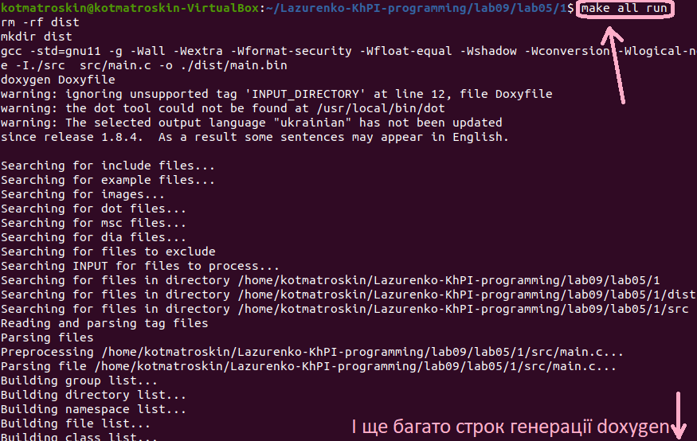
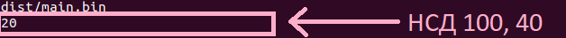
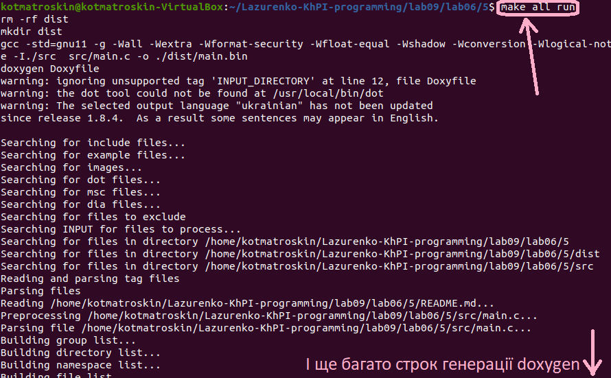
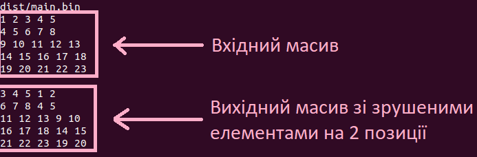

# Загальне завдання
Реалізувати програми відповідно до індивідуальних завдань.

Індивідуальне завдання
1. Знайти НСД для двох заданих чисел.
2. Виконати циклічне зрушення елементів рядків двомірного масиву в напрямку справа наліво. 

**ВИКОНАННЯ РОБОТИ**
2.1 Визначення варіантів індивідуальних завдань.
	Перше завдання у п'ятій, та п'яте у шостій лабораторній роботі.
2.2 Функціональне призначення
	Програма призначена для знаходження НСД двох чисел.
	Програма призначена для виконання циклічного зрушення елементів масиву NxN в напрямку справа наліво.
2.3 Написання коду програми
```
#include <stdio.h>

int nod (int x, int y) {
	int i;
	while (x > 0) {
		if (x < y) {		//exchanging
			i = x;
			x = y;
			y = i;
			}
		while (x >= y) {	//the remainder
			x = x - y;
			}			
	}
	return y;
}

int main (){
	int a = 100;	//first number
	int b = 40;	//second number
	
	int res = nod(a, b);
		
	printf ("%d \n", res);
	return 0;
}
```


```
#include <stdio.h>
#define ARRAY_SIZE 5	//array size

void shift_left (int a[ARRAY_SIZE][ARRAY_SIZE], int n){
	int r, c, b;	//row, column, buffer
	int j, k;
	n = n % ARRAY_SIZE;
	if (n != 0) {
		for (r = 0; r < ARRAY_SIZE; r++) {
			k = 1;
			c = 0;
			b = a[r][c];
			do {
				j = c + n;
				if (j >= ARRAY_SIZE) j -= ARRAY_SIZE;
				a[r][c] = a[r][j];
				c = j;
				k++;
			} while (k < ARRAY_SIZE);
			a[r][c] = b;
		}
	}	
}

void show (int S[ARRAY_SIZE][ARRAY_SIZE]) {
	int l, c;
	for (l = 0; l < ARRAY_SIZE; l++) {
		for (c = 0; c < ARRAY_SIZE; c++) {
			printf("%d ", S[l][c]);
		}
		printf("\n");
	}
	printf("\n");	
}

int main() {
	int array[ARRAY_SIZE][ARRAY_SIZE] = {
		{1, 2, 3, 4, 5},
		{4, 5, 6, 7, 8},
		{9, 10, 11, 12, 13},
		{14, 15, 16, 17, 18},
		{19, 20, 21, 22, 23}
	};
	int n = 2;
	
	show (array);
	shift_left (array, n);
	show (array);
	return 0;
}
```


2.4 Компіляція проектів, та перевірка правильності роботи програми






Висновок:
Я створив програму, яка працює за своїм функціональним призначення за допомогою власно написаного коду.
